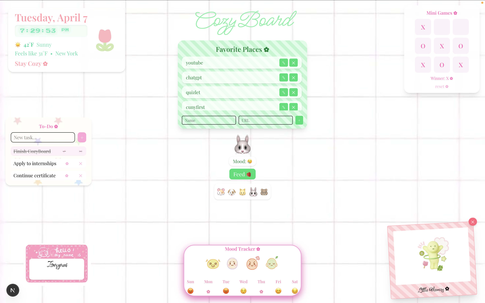

# 🧸 CozyBoard – Personal Cozy Dashboard

A cozy, interactive personal dashboard that blends productivity, self-care, and fun into one aesthetic space. Built with Next.js, TypeScript, and Tailwind CSS, this app combines real-time data, local storage persistence, and playful UI elements into a unique “cozy web experience.”

Designed as a creative portfolio project to showcase front-end interactivity, state management, and user-focused design.

---

## 🌟 Highlights

- ✨ Real-time clock + live weather based on location  
- 📝 Interactive to-do list with animations  
- 🔗 Custom favorite links manager (add/edit/delete)  
- 🐾 Virtual pet with mood system  
- 🎭 Mood tracker with weekly history + effects  
- 📸 Uploadable polaroid memory system  
- 🎮 Mini games (Tic-Tac-Toe + more)  
- 💾 Persistent state using localStorage  
- 🎨 Fully aesthetic, cozy UI design  
- 🚀 Deployed on Vercel  

---

## 🎯 Why I Built This

I wanted to create something that wasn’t just another dashboard.

Most productivity apps feel cold and strict — so I built CozyBoard to feel warm, personal, and fun, while still being functional.

This project helped me strengthen my ability to:
- Manage complex UI state across multiple features  
- Design interactive and engaging user experiences  
- Combine productivity tools with playful elements  
- Build something users would actually enjoy opening daily  

---

## 🧭 Features Overview

### 🕒 Real-Time Clock + Weather
- Live updating clock with subtle animation effects  
- Location-based weather using geolocation  
- “Feels like” temperature + condition display  
- Reverse geocoding for city name  

### 🔗 Favorite Links Manager
- Add, edit, and delete custom links  
- Scrollable container with clean UI  
- Stored in localStorage for persistence  

### 📝 To-Do List
- Add and complete tasks  
- Visual feedback (strike-through + sparkles ✨)  
- Animated delete system  
- Scrollable task container  

### 🐾 Virtual Pet
- Select your pet (🐶 🐱 🐰 etc.)  
- Mood system that changes over time  
- Feed interaction to restore happiness  
- Visual mood indicator  

### 🎭 Mood Tracker
- Track daily moods (excited, sad, angry, chill)  
- Weekly mood history visualization  
- Random comforting quotes  
- Animated effects (rain, confetti, sparks, leaves)  

### 📸 Polaroid Memory
- Upload personal images  
- Styled as polaroid cards  
- Stored locally for persistence  

### 🎮 Mini Games
- Tic-Tac-Toe with win detection  
- Emoji interaction system  
- Memory game based on uploaded images  

---

## 🧠 Engineering Concepts Demonstrated

- Advanced React state management  
- Complex UI composition & layout control  
- Event handling (dragging, animations, interactions)  
- Derived state & conditional rendering  
- Local persistence using localStorage  
- Async data fetching (weather + geolocation APIs)  
- Responsive design techniques  
- Component-based architecture  

---

## 🛠 Tech Stack

### Frontend
- Next.js (App Router)  
- TypeScript  
- Tailwind CSS  

### APIs
- Open-Meteo (weather data)  
- OpenStreetMap (reverse geocoding)  

### Deployment
- Vercel  

---

## 🚀 Live Demo

- **Live App:** https://cozyboard-xi.vercel.app/room  
- **Repository:** https://github.com/zayanicg/cozyboard  

---

## ⚙️ Run Locally

```bash
git clone https://github.com/zayanicg/cozyboard.git
cd cozyboard
npm install
npm run dev
📁 Project Structure
app/
  page.tsx
public/
  screenshot.png
  images/
styles/
📸 App Screenshot

🚀 Future Improvements
Edit/update tasks instead of only add/delete
User authentication (save data across devices)
Database integration (Supabase or Firebase)
Theme customization (dark mode, color themes)
Improved mobile responsiveness
AI-powered Tic-Tac-Toe opponent (Minimax algorithm)

🤝 Feedback

Suggestions, improvements, and ideas are always welcome.
Feel free to open an issue or contribute to the project.

If you found this project interesting, consider giving it a ⭐

👤 Author

Zayani Garcia
Computer Science Graduate | Aspiring Full-Stack Developer

GitHub: https://github.com/zayanicg
